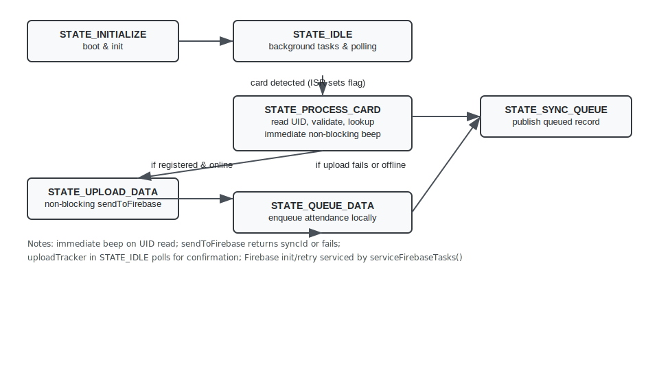

# TapTrack-Embedded

This repository contains TapTrack — an ESP32-based RFID attendance system implemented using a minimal-intrusion Finite State Machine (FSM) design. The firmware is written for the Arduino framework (PlatformIO) and focuses on responsiveness (non-blocking operations), interrupt-driven card detection, and a centralized, non-blocking indicator (LED + buzzer) subsystem.


---

**Contents**
- `src/main.cpp`: Main FSM, state handlers, connectivity and upload logic.
- `src/indicator.cpp`: LED and buzzer control (non-blocking buzzer sequencer).
- `src/RFID.cpp`: MFRC522 RFID handling and ISR for card detection.
- `src/Firebase.cpp`: Firebase client integration (non-blocking send/loop usage).
- `include/*.h`: Configuration, hardware pin mapping, and helper headers.

---

**Overview — Finite State Machine (FSM)**

The application runs as a small FSM with the following states:
- **STATE_INITIALIZE**: Boot, peripheral init, non-blocking Firebase init kick-off.
- **STATE_IDLE**: Low-activity state. Services background tasks, checks interrupts for card detection, and triggers queue sync.
- **STATE_PROCESS_CARD**: Reads UID from the RFID reader, validates RTC, checks duplicates, looks up user, provides immediate feedback (beep), and decides next state.
- **STATE_UPLOAD_DATA**: Non-blocking upload attempt to Firebase; returns to `STATE_IDLE` immediately while waiting for asynchronous confirmation.
- **STATE_QUEUE_DATA**: Enqueue attendance locally when offline or upload fails.
- **STATE_SYNC_QUEUE**: Dedicated queue-sync state used to publish queued attendance records when online and no upload is active.

The FSM is implemented in `src/main.cpp` using `transitionTo()` and dedicated `handle*()` functions for each state.

---

**Diagrams**

- ASCII FSM diagram: `docs/FSM_ASCII.txt`
- SVG flowchart: `docs/fsm_diagram.svg`
 
 <p align="center">
   
 </p>

---

## Interrupt-driven card detection (bare-metal pattern)
An ESP32-based RFID attendance system implemented with a clear Finite State Machine (FSM), interrupt-driven card detection, and non-blocking scheduling for responsiveness. The codebase targets PlatformIO / Arduino and is optimized to provide immediate user feedback while remaining resilient to network failures.
- The FSM polls this flag inside `handleIdle()` using `noInterrupts()/interrupts()` to read it atomically.
- A short stabilization / debounce window (20 ms) is implemented using `millis()` so the FSM transitions to `STATE_PROCESS_CARD` only when the card is confirmed present — this avoids blocking the loop.
- [Quick Start](#quick-start)
- [Runtime sequencing (compact)](#runtime-sequencing-compact)
- [FSM Overview](#fsm-overview)
- [Non-blocking & scheduling](#non-blocking--scheduling)
- [Diagrams](#diagrams)
- [Components](#components)
- [Function reference](#function-reference-top-level-functions-in-srcmaincpp)
- [Build & Test](#build--test)
- [Notes & next steps](#notes--next-steps)
- [Troubleshooting](#troubleshooting)
- [Contributing](#contributing)
- **Scheduled restart (non-blocking long-press)**: A long-press clears WiFi and schedules a restart (`restartPending` + `restartAt`) while playing a long beep, allowing the loop to continue servicing other tasks until the restart time is reached.
- **Main loop orchestration**: `loop()` remains the single cooperative scheduler: it calls `checkStateTimeout()`, `processSerialCommand()`, `updateIndicator()`, `serviceFirebaseTasks()`, handles scheduled restart, then runs the current state's handler. This keeps the system responsive and deterministic.
Build and upload with PlatformIO:

```bash
platformio run
platformio run --target upload
platformio device monitor --baud 115200
```

Make sure `secrets.h` contains your WiFi and Firebase credentials (not committed).
---

This summarizes the runtime order of events for a normal registered tap (compact timeline):

1. ISR: `readCardISR()` fires on RFID IRQ → sets `cardDetected = true`.
2. `handleIdle()` atomically reads `cardDetected` and uses a 20 ms stabilization window to debounce.
3. Transition to `STATE_PROCESS_CARD`.
4. `handleProcessCard()` calls `readCardUID()` → valid UID.
5. Populate `stateContext`, call `userDB.recordTap(uid)` (if registered).
6. `indicateSuccessOnline()` schedules the buzzer/LED sequence (non-blocking).
7. `transitionTo(STATE_UPLOAD_DATA)`.
8. `handleUploadData()` calls `sendToFirebase(...)`; on success it returns a `syncId` and `uploadTracker.start(syncId, uid)` is called.
9. `transitionTo(STATE_IDLE)` immediately — upload continues asynchronously.
10. `handleIdle()` polls `uploadTracker.active` until `isSyncConfirmed(syncId)`; on confirmation the queue entry is removed and success indicated.

This sequencing ensures immediate local feedback and non-blocking network operations.

- **`checkFirebaseConnection()`**: Throttles periodic attempts to (re)initialize Firebase — sets retry/init flags rather than blocking.
The FSM in `src/main.cpp` is composed of these states:
- `STATE_INITIALIZE` — boot, peripheral init, kick off non-blocking Firebase init.
- `STATE_IDLE` — background tasks, poll ISR flag, start queue sync when appropriate.
- `STATE_PROCESS_CARD` — read UID, validate, user lookup, immediate feedback, decide next state.
- `STATE_UPLOAD_DATA` — start non-blocking upload and return to IDLE.
- `STATE_QUEUE_DATA` — enqueue attendance when offline or upload fails.
- `STATE_SYNC_QUEUE` — dedicated state for sending queued records.

Transitions are handled by `transitionTo()` and each state has a `handle*()` function.
  - Reads UID via `readCardUID()`.
  - If the read fails: logs `LOG_ERROR("[CARD] Failed to read UID\n")`, clears IRQ and returns to `STATE_IDLE`.
The system provides immediate UX feedback while network and I/O run concurrently and without blocking the FSM.

- **`handleSyncQueue()`**: Attempts to publish a queued record to Firebase. If successful it sets the queue entry's `syncId` and starts `uploadTracker`; otherwise it bumps retry counters and moves the record to the back to retry later.
ASCII FSM diagram: `docs/FSM_ASCII.txt`
SVG flowchart: `docs/fsm_diagram.svg`

<p align="center">
  
</p>
## Build & Test

Detailed hardware and software component descriptions are below (unchanged from the previous section). Key files:
- `src/main.cpp`, `src/indicator.cpp`, `src/RFID.cpp`, `src/Firebase.cpp`, `include/*.h`.

See the full component and hardware sections further down for pinouts and integration notes.

Upload to a connected ESP32:
<details>
<summary>Click to expand function reference</summary>

- `transitionTo(SystemState newState)` — central state transition helper.
- `checkStateTimeout()` — watchdog to detect and recover from hung states.
- `checkModeButton()` / `toggleMode()` — mode button handling with non-blocking restart scheduling.
- `isRTCValid(const DateTime& time)` — validate RTC values.
- `getAttendanceStatus()` / `formatTimestamp()` — timestamp helpers.
- `isDuplicateTap(String uid)` — duplicate tap prevention.
- `checkAndReconnectWiFi()` — WiFi logic per mode.
- `checkFirebaseConnection()` / `serviceFirebaseTasks()` — Firebase non-blocking init/retry.
- `onUserChange(...)` — user-stream callback.
- `handleInitialize()`, `handleIdle()`, `handleProcessCard()`, `handleUploadData()`, `handleQueueData()`, `handleSyncQueue()` — state handlers.
- `processSerialCommand()` — serial console commands.

</details>
  - Tune beep durations in `include/config.h`.
  - Convert any intentionally blocking test/startup delays to non-blocking timers.
Build and upload with PlatformIO (zsh):

```bash
platformio run
platformio run --target upload
platformio device monitor --baud 115200
```

---

## Notes & next steps

- The project minimizes RTOS usage and follows a baremetal-friendly, interrupt-driven design.
- Intentional blocking calls used in `startupSequence()` / test helpers are left as-is; I can convert them to non-blocking timers on request.
- Possible next tasks:
  - Tune beep durations in `include/config.h`.
  - Convert startup/test blocking delays to non-blocking timers.
  - Add an example serial transcript for a successful tap.

---

## Troubleshooting

- If the device does not boot: open serial monitor and check for early errors.
- If RFID misses taps: verify IRQ wiring and confirm `docs/FSM_ASCII.txt` for timing; ensure `RFID_IRQ_PIN` matches hardware.
- If Firebase fails to connect: confirm credentials in `secrets.h` and check WiFi status via serial commands.

---

## Contributing

PRs welcome: keep changes minimal and focused. Use PlatformIO to build and test locally.
- [Contributing](#contributing)

## Key Features

- **Interrupt-Driven RFID Detection**: Real-time, non-blocking card detection using hardware interrupts.
- **Finite State Machine (FSM) Architecture**: State-based mode management for robust online/offline transitions.
- **Hybrid Connectivity**: Seamless online (Firebase) and offline (local queue) operation.
- **Real-Time Sync**: Automatic Firebase streaming and attendance syncing.
- **User-Friendly UI/UX**: WiFi portal, indicators, and serial commands.
- **Persistent Storage**: SPIFFS-based data persistence.
- **Custom GPIO Wrapper**: Direct ESP32 GPIO control via custom functions for maximum hardware efficiency and baremetal performance.

## Architecture Overview

### Baremetal Design
The system is designed as a **baremetal embedded application** running directly on the ESP32 microcontroller, with no full operating system (OS) layer. While it leverages the Arduino framework for simplicity, it operates at a low level, interfacing directly with hardware for maximum control and efficiency. This addresses potential concerns about "true" baremetal status by emphasizing direct hardware manipulation over OS abstractions.

#### What Makes It Baremetal?
- **No Desktop OS**: Unlike systems running Windows, Linux, or macOS, the ESP32 executes code directly on its Xtensa cores without a general-purpose OS. The Arduino framework provides a thin abstraction layer over ESP-IDF (Espressif IoT Development Framework), which includes FreeRTOS—a lightweight real-time OS (RTOS). However, in this project, FreeRTOS is minimally used (e.g., for task scheduling in `loop()`), and most operations are single-threaded, interrupt-driven, and hardware-centric, aligning with baremetal principles.
- **Direct Hardware Access**: Code interacts directly with ESP32 peripherals via registers and GPIO pins. For example:
  - GPIO pins are configured manually using a custom wrapper (`gpio.h`/`gpio.cpp`) that interfaces directly with ESP32 GPIO registers, avoiding Arduino abstractions like `pinMode()` and `digitalWrite()`.
  - SPI communication with MFRC522 and DS1302 uses direct SPI registers, not abstracted drivers.
  - Interrupts are attached via `attachInterrupt()`, triggering ISRs that manipulate hardware flags immediately.
- **Single-Threaded Execution**: The main logic runs in a simple `setup()` → `loop()` cycle, with interrupts for asynchronous events. No multi-threading or OS processes; everything is event-driven and deterministic.
- **Low-Level Resource Management**: Memory is managed manually (e.g., SPIFFS for storage, no dynamic allocation in critical paths). Flash and RAM usage is monitored to stay under limits, with no OS memory protection or virtual memory.
- **Real-Time Constraints**: Interrupts ensure sub-millisecond responses (e.g., RFID detection), critical for embedded systems. Polling is used judiciously for non-real-time tasks, avoiding OS overhead.

#### Addressing Framework Concerns
If the Arduino framework is seen as "not baremetal," note that Arduino on ESP32 is built on ESP-IDF/FreeRTOS but allows baremetal-style programming:
- Arduino abstracts setup (e.g., `Serial.begin()`) but doesn't hide hardware; you can access ESP32-specific APIs (e.g., WiFi registers).
- The project avoids high-level libraries where possible (e.g., custom SPIFFS handling), prioritizing direct control.
- True baremetal (no RTOS) would require pure assembly/C with ESP-IDF, but this hybrid approach achieves similar efficiency while being practical for development.

In summary, while not "pure" baremetal (due to FreeRTOS), the system embodies baremetal embedded design: direct hardware interaction, real-time performance, and minimal abstraction, making it suitable for resource-constrained, responsive applications.

### Interrupt-Driven Design
The system leverages hardware interrupts for efficient, responsive operation, particularly for RFID card detection. This prevents blocking the main loop and ensures low power consumption.

#### How It Works
- **RFID Module (MFRC522)**: Connected via SPI, with an IRQ (Interrupt Request) pin linked to ESP32 GPIO (e.g., pin 5).
- **Interrupt Service Routine (ISR)**: `readCardISR()` in `RFID.cpp` is attached to the IRQ pin with `attachInterrupt(digitalPinToInterrupt(RFID_IRQ_PIN), readCardISR, FALLING)`.
  - Triggered on falling edge when a card is detected.
  - Sets a volatile global flag `cardDetected = true`.
  - ISR is minimal (no delays, serial prints) to avoid issues.
- **Main Loop Processing**: In `main.cpp` loop(), checks `if (cardDetected)` to read UID, validate user, and record attendance.
- **Benefits**: Instant response to card taps, CPU freed for other tasks (WiFi, Firebase), reduced polling overhead.
- **Other Interrupts**: None currently; WiFi/Firebase use polling for simplicity.

#### Code Flow
1. Setup: `initRFID()` initializes MFRC522 and attaches interrupt.
2. Card Tap: ISR fires → flag set.
3. Loop: Flag checked → `readCardUID()` → user lookup → attendance logic → feedback.

### Finite State Machine (FSM)
The FSM manages system modes, ensuring predictable behavior and easy transitions based on inputs.

#### States
- **AUTO**: Default mode. Adapts to connectivity: online if WiFi/Firebase available, offline otherwise. Syncs when possible.
- **FORCE_ONLINE**: Prioritizes online features. Forces WiFi connection and Firebase sync, even if unstable.
- **FORCE_OFFLINE**: Disables network. Uses local database only, no sync attempts.

#### Transitions
- **Button Press**: Short press cycles states (AUTO → FORCE_ONLINE → FORCE_OFFLINE → AUTO).
- **Serial Commands**: 'o' (online), 'f' (offline) override current state.
- **Connectivity Events**: WiFi loss switches to offline; reconnection enables sync.
- **Timeouts**: Portal timeout defaults to offline.

#### Implementation
- **Enum**: `SystemMode` in `config.h` defines states.
- **Logic**: `toggleMode()` in `main.cpp` handles transitions based on press duration.
- **Global State**: `currentMode` tracks current state; loop() adapts behavior (e.g., sync only in online modes).
- **Benefits**: Prevents conflicts (e.g., no sync in offline), simplifies debugging, handles edge cases (e.g., network failures).

#### Code Flow
1. Setup: `currentMode = DEFAULT_SYSTEM_MODE` (AUTO).
2. Input: Button/serial triggers transition.
3. Loop: Checks `currentMode` to enable/disable WiFi/Firebase.
4. Events: Connectivity changes update state if AUTO.

## Component Details

### Hardware Components

#### ESP32 Microcontroller
- **Role**: Central processing unit handling all logic, interrupts, WiFi, Firebase communication, and storage.
- **Key Features**: Dual-core processor, WiFi/Bluetooth, GPIO pins for peripherals, SPIFFS for file storage.
- **Integration**: Runs Arduino framework; manages FSM states, processes RFID interrupts, controls indicators.
- **Power**: 3.3V, low power in sleep modes.
- **Configuration**: Pins defined in `config.h`; firmware uploaded via PlatformIO.

#### MFRC522 RFID Module
- **Role**: Reads RFID/NFC cards for attendance tracking.
- **Key Features**: SPI interface, 13.56MHz frequency, supports MIFARE cards, interrupt-capable IRQ pin.
- **Integration**: Connected via SPI (SDA, SCK, MOSI, MISO); IRQ pin triggers interrupt on card detection.
- **Operation**: ISR sets flag; main loop reads UID, validates user.
- **Health Checks**: Periodic resets via `checkAndResetMFRC522()` to handle failures.

#### DS1302 RTC Module
- **Role**: Provides accurate timekeeping for attendance timestamps.
- **Key Features**: Low-power clock chip, battery backup, SPI interface.
- **Integration**: Connected via GPIO (CLK, DAT, RST); initialized in setup, queried for timestamps.
- **Operation**: Stores time in Unix format; used to determine attendance status (present/late).
- **Accuracy**: Maintains time even during power loss.

#### Indicators (Buzzer and LEDs)
- **Role**: Provide user feedback for attendance events.
- **Key Features**: Buzzer for audio alerts, LEDs for visual status (success/error).
- **Integration**: GPIO outputs; controlled via `indicator.h` functions (e.g., `playSuccessTone()`).
- **Operation**: Triggered after attendance processing; patterns indicate success/error.

#### Mode Button
- **Role**: Allows manual FSM state transitions.
- **Key Features**: Push button with pull-up resistor.
- **Integration**: GPIO input; polled in loop with debouncing.
- **Operation**: Short press cycles modes; long press resets WiFi.

### Software Components

#### main.cpp
- **Role**: Main application file; orchestrates setup, loop, FSM, and attendance.
- **Key Functions**:
  - `setup()`: Initializes modules, WiFi menu, Firebase.
  - `loop()`: Handles interrupts, attendance, sync, serial commands.
  - `toggleMode()`: Manages FSM transitions.
  - `processAttendance()`: Core logic for user validation and recording.
- **Integration**: Calls functions from other modules; global state management.

#### RFID.cpp
- **Role**: Handles RFID card detection and reading.
- **Key Functions**:
  - `initRFID()`: Sets up MFRC522 and interrupt.
  - `readCardISR()`: ISR for card detection.
  - `readCardUID()`: Reads and returns UID.
  - `checkAndResetMFRC522()`: Health monitoring.
- **Integration**: Interrupt-driven; provides UID to main loop.

#### WifiManager.cpp
- **Role**: Manages WiFi connections and captive portal.
- **Key Functions**:
  - `initWiFiManager()`: Attempts connection or starts portal.
  - `startCaptivePortal()`: Web server for WiFi setup.
  - `connectToWiFi()`: Handles STA mode connection.
- **Integration**: Called from main for online mode; uses Preferences for credentials.

#### Firebase.cpp
- **Role**: Handles Firebase Realtime Database sync and streaming.
- **Key Functions**:
  - `initFirebase()`: Initializes client and auth.
  - `syncQueuedAttendance()`: Pushes offline data.
  - `streamUsers()`: Listens for user updates.
- **Integration**: Active in online modes; uses FirebaseClient library.

#### UserDatabase.h
- **Role**: Manages local user storage in SPIFFS.
- **Key Features**: JSON-based storage; loads/saves users.
- **Functions**: `loadUsers()`, `saveUsers()`, `findUserByUID()`.
- **Integration**: Fallback when offline; synced from Firebase.

#### AttendanceQueue.h
- **Role**: Queues attendance records for offline sync.
- **Key Features**: JSON array in SPIFFS; FIFO queue.
- **Functions**: `addRecord()`, `getAllRecords()`, `clearQueue()`.
- **Integration**: Used in offline mode; synced when online.

#### config.h
- **Role**: Defines constants, pins, modes.
- **Contents**: GPIO mappings, intervals, FSM enums.
- **Usage**: Centralized configuration for easy changes.

#### gpio.h & gpio.cpp
- **Role**: Custom GPIO wrapper for direct ESP32 GPIO control.
- **Key Features**: Provides functions like `gpio_pin_init()`, `gpio_write()`, `gpio_read()` that interface directly with ESP32 GPIO registers, supporting input/output modes and pull-up/down resistors.
- **Integration**: Used throughout the project for all GPIO operations (LEDs, buzzer, buttons, RTC), replacing Arduino GPIO functions for better performance and control.
- **Benefits**: Eliminates Arduino abstraction overhead, ensures consistent baremetal-style hardware access.

#### secrets.h
- **Role**: Stores sensitive credentials.
- **Contents**: WiFi SSID/password, Firebase host/auth.
- **Security**: Not committed to repo; user-provided.

### Data Flow
1. **Card Tap**: Interrupt → UID read → User lookup (local/Firebase).
2. **Attendance**: Timestamp → Status (present/late) → Queue/Sync based on mode.
3. **Sync**: Online modes push queue to Firebase, stream updates.
4. **Feedback**: LED/buzzer/serial confirm actions.

## Hardware Setup

### Pin Connections (ESP32)
- **RFID MFRC522**:
  - SDA: GPIO 21
  - SCK: GPIO 18
  - MOSI: GPIO 23
  - MISO: GPIO 19
  - IRQ: GPIO 5 (interrupt pin)
  - GND: GND
  - RST: GPIO 22
  - 3.3V: 3.3V
- **DS1302 RTC**:
  - CLK: GPIO 14
  - DAT: GPIO 13
  - RST: GPIO 12
  - GND: GND
  - VCC: 3.3V
- **Indicators**:
  - Buzzer: GPIO 25
  - LED Success: GPIO 26
  - LED Error: GPIO 27
- **Mode Button**: GPIO 4 (with pull-up)

### Assembly Notes
- Ensure SPI pins are not conflicted.
- Use level shifters if needed for 5V modules.
- Test connections with multimeter.

## Software Architecture

### Core Files
- **main.cpp**: Initializes all modules, runs FSM, handles attendance.
- **RFID.cpp**: Manages card detection and reading.
- **WifiManager.cpp**: Handles WiFi setup and portal.
- **Firebase.cpp**: Manages database sync and streaming.
- **UserDatabase.h**: Class for local user storage (SPIFFS JSON).
- **AttendanceQueue.h**: Class for offline queue (SPIFFS JSON).
- **gpio.h & gpio.cpp**: Custom GPIO wrapper for direct ESP32 hardware control.

### Key Functions
- **setup()**: Initializes SPIFFS, RFID, WiFi menu, Firebase if online.
- **loop()**: Checks interrupts, processes attendance, syncs if online, handles serial.
- **readCardUID()**: Reads UID, clears buffer.
- **processAttendance()**: Validates user, records attendance.
- **syncQueuedAttendance()**: Pushes queue to Firebase.

### Libraries Used
- Arduino core for ESP32.
- MFRC522 for RFID.
- FirebaseClient for database.
- SPIFFS for storage.
- WiFi for connectivity.

## Configuration

### config.h
- Define pins, modes, intervals (e.g., SYNC_INTERVAL = 30000 ms).
- Set DEFAULT_SYSTEM_MODE (AUTO).

### secrets.h
- WIFI_SSID, WIFI_PASSWORD.
- FIREBASE_HOST, FIREBASE_AUTH.

### Customization
- Change FSM states in config.h.
- Adjust timings in main.cpp.

## Build and Upload

### Prerequisites
- PlatformIO or Arduino IDE.
- ESP32 board selected.

### Steps
1. Install dependencies: `pio lib install`.
2. Build: `pio run`.
3. Upload: `pio run --target upload`.
4. Monitor: `pio device monitor`.

## Usage

### Startup
- Power on; serial shows menu (10s timeout to offline).
- Type 'o' for online.

### Operation
- Tap card: Attendance recorded.
- Button: Toggle modes.
- Serial: Commands like 'status', 'sync'.

### Modes
- AUTO: Adaptive.
- FORCE_ONLINE: Always sync.
- FORCE_OFFLINE: Local only.

## Data Flow

### Attendance Recording
1. Interrupt detects card.
2. Read UID.
3. Check duplicate (30s).
4. Lookup user (local/Firebase).
5. Get time from RTC.
6. Determine status (present/late).
7. Queue or sync based on mode.
8. Feedback via indicators.

### Sync Process
- Online: Push queue to Firebase /attendance.
- Confirm success, clear queue.
- Stream /users for updates.

## Troubleshooting

### Common Issues
- **No RFID Detection**: Check IRQ pin, power.
- **WiFi Fails**: Verify credentials, signal.
- **Firebase Errors**: Check auth, network.
- **Button Not Working**: Check GPIO, pull-up.

### Logs
- Serial output shows status.
- Use 'debug' command for more info.

### Reset
- Hard reset ESP32.
- Clear SPIFFS: `pio run --target erase`.

## FAQ

### Q: How does interrupt-driven RFID work in detail?
A: The MFRC522 signals card presence via IRQ pin. ESP32 ISR immediately flags detection. Main loop processes UID, checks duplicates (30s cooldown), looks up user in local/Firebase DB, determines status (e.g., present if before 9 AM), queues/sends attendance, provides feedback. This non-blocking design ensures responsiveness.

### Q: Explain FSM logic and transitions.
A: FSM uses `currentMode` to control behavior. AUTO mode checks WiFi/Firebase readiness; FORCE_ONLINE forces connection via portal; FORCE_OFFLINE skips network. Transitions via button (debounced, duration-based) or serial. Loop adapts: sync in online, queue in offline. Prevents invalid states (e.g., sync without connection).

### Q: Why default offline?
A: Prevents auto-connect failures. Startup menu (10s timeout) lets user choose; serial 'o' enables WiFi/Firebase. Ensures reliability.

### Q: Offline data handling?
A: Attendance queued in SPIFFS JSON. Online sync pushes all, confirms success, clears queue. Handles duplicates via UID/timestamp.

### Q: Customizing FSM?
A: Add states to `SystemMode`, update `toggleMode()` for new transitions. Test thoroughly.

### Q: RFID failure handling?
A: Health checks reset module periodically. Serial diagnostics show status.

### Q: WiFi reset?
A: Long button press or serial 'clear wifi' erases credentials, triggers portal.

For code details, see comments in source files.

## Contributing
Follow interrupt-driven and FSM patterns. Test changes thoroughly.